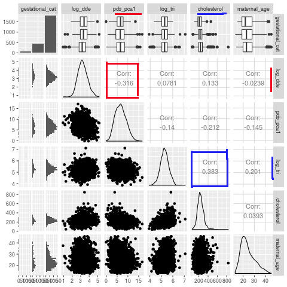

```{r setup, include=FALSE}
knitr::opts_chunk$set(echo = FALSE)
```

```{r, echo=FALSE, eval = TRUE, warning = FALSE, message = FALSE}
library(tidyverse)
library(mice)
library(nnet)
library(corrplot)
library(quantreg)
library(MASS)
library(knitr)
library(tigerstats)
library(ggplot2)
set.seed(43)

Long <- readRDS("Longnecker.rds")
longnecker_b <- Long
Long <- Long %>% mutate(albuminTested = ifelse(is.na(albumin), 0, 1)) %>% filter(gestational_age <= 44) %>% 
  filter(!is.na(pcb_028)) %>% dplyr::select(-albumin)


Long = Long %>% mutate(termCat = cut(gestational_age, c(breaks = c(0, 32, 37 ,45))), center = as.character(center),
                       pcb = pcb_028 + pcb_052 + pcb_074 + pcb_105 + pcb_118 + pcb_153 + pcb_170 +
                            pcb_138 + pcb_180 + pcb_194 + pcb_203,
                       # ed_norm = qnorm(score_education / 100),
                       # inc_norm = qnorm(score_education / 100),
                       # occ_norm = qnorm(score_occupation / 100),
                       dde.cut = cut(dde, breaks = 5),
                       pcb.cut = cut(pcb, breaks = 5),
                       gestord = factor(termCat, ordered = TRUE)
                       ) %>% filter(!is.na(pcb))


# ADD PRINCIPLE COMPONENTs
pcb_mat = as.matrix(Long %>% dplyr::select(contains("pcb_")))
min_pcb <- min(pcb_mat[pcb_mat > 0])
pcb_mat[pcb_mat == 0] <- min_pcb / 2
pcb_mat <- apply(pcb_mat, 2, log)
pcb.pr = prcomp(pcb_mat, center = T, scale = T)

Long = Long %>% mutate(logPCB1 = -pcb.pr$x[,1], logPCB2 = pcb.pr$x[,2], logPCB3 = pcb.pr$x[,3])

##

# Long_Score_NA_rm = Long %>% filter(!is.na(score_education + score_occupation + score_income))
# modordscore = polr(gestord ~ center + log(dde) + log(pcb) + score_education + score_occupation + score_education + log(triglycerides) + maternal_age + smoking_status + cholesterol + albuminTested, data = Long_Score_NA_rm)
# modordscorecomp = polr(gestord~ center+log(dde) + log(pcb)+log(triglycerides) + maternal_age + smoking_status + cholesterol + albuminTested, data = Long_Score_NA_rm)
# anova(modordscore, modordscorecomp)
# 
# modordcenter = polr(gestord~ center*log(dde) + center*log(pcb) + log(triglycerides) + maternal_age + smoking_status + cholesterol + albuminTested, data = Long)
# modord = polr(gestord~ center+log(dde) + log(pcb)+log(triglycerides)  + maternal_age + smoking_status + cholesterol + albuminTested, data = Long)
# summary(modord)
# anova(modord, modordcenter)


### BASE MODEL

Long.Base.Mod = polr(gestord~ center + log(dde) + logPCB1 + log(triglycerides)  + maternal_age + smoking_status + log(cholesterol) + 
                       albuminTested + race, data = Long,
                     Hess = T)
# summary(Long.Base.Mod)
Base.Confint = confint(Long.Base.Mod)
# Base.Confint
# knitr::kable(Base.Confint, "latex")

### PCA Analysis ###

Long.PCA.1.2.3 = polr(gestord~ center + log(dde) + logPCB1 + logPCB2 + logPCB3 + log(triglycerides)  + maternal_age + smoking_status + log(cholesterol) + albuminTested + race, data = Long)


# Long.PCA.logged = polr(gestord~ center + log(dde)*log(logPCB1) + log(triglycerides)  + maternal_age + smoking_status + cholesterol + albuminTested, data = Long)


PCA.anova = anova(Long.Base.Mod, Long.PCA.1.2.3)

## Second and third components add very little


#############################################
### MICE with ORDLOG - check score usefulness
#############################################

# impLong = mice(Long, printFlag = F)
impLong = mice(Long %>% mutate(ldde = log(dde), ltrig = log(triglycerides), lchol = log(cholesterol)) %>% 
                 dplyr::select(gestord,center, score_occupation, score_education, score_income, ldde, logPCB1,
                                 ltrig, maternal_age, smoking_status, lchol,
                                 albuminTested,race), printFlag = F)
imp.OL.Mod = with(impLong, polr(gestord ~ center + score_occupation +score_education +
                                  score_income + ldde + logPCB1 + 
                                    ltrig  + maternal_age + smoking_status + 
                                    lchol + albuminTested + race, Hess = T))

imp.OL.Mod.wo.score = with(impLong, polr(gestord ~ center  + ldde + logPCB1 + 
                                    ltrig  + maternal_age + smoking_status + 
                                    lchol + albuminTested + race, Hess = T))

score.p.value = pool.compare(imp.OL.Mod, imp.OL.Mod.wo.score)$pvalue

MICE.summary = summary(pool(imp.OL.Mod))

## Strong evidence that score does not add anything


##########################################
###### Check Center Interactions/inclusion
##########################################

center.inter.mod = polr(gestord~ center*log(dde) + center*logPCB1 + log(triglycerides)  + maternal_age + smoking_status + log(cholesterol) + albuminTested + race, data = Long, Hess = T)

Center.Inter.Anova = anova(center.inter.mod, Long.Base.Mod)

## Note that center interaction not significant

no.center.mod = polr(gestord~ log(dde) + logPCB1 + log(triglycerides)  + 
                       maternal_age + smoking_status + log(cholesterol) + albuminTested + race, data = Long, Hess = T)

Center.Inclusion.Anova = anova(no.center.mod, Long.Base.Mod)

# Strong evidence that including center is useful

##########################################
#### Check Chemical interactions
##########################################


## DDE PCA Interaction
Long.PCA.DDE.Inter.Mod = polr(gestord~ center + log(dde) * logPCB1 + log(triglycerides)  + maternal_age + 
                                smoking_status + log(cholesterol) + albuminTested + race, data = Long, Hess = T)

DDE.PCA.Inter.Anova = anova(Long.Base.Mod, Long.PCA.DDE.Inter.Mod)

# Not evidence that dde-pcb interact

## DDE/PCA Triglyceride Interaction
# Justified because these chemicals are fat-soluble.
Long.Trig.Inter.Mod = polr(gestord~ center + log(dde)*log(triglycerides) + logPCB1*log(triglycerides)  + 
                             maternal_age + smoking_status + log(cholesterol) + albuminTested + race, data = Long, Hess = T)

Trig.Inter.Anova = anova(Long.Base.Mod, Long.Trig.Inter.Mod)


##########################################
#### check maternal age poly #############
##########################################

Long.Age.Poly.Mod = polr(gestord~ center + log(dde) + logPCB1 + log(triglycerides)  + poly(maternal_age,2) + smoking_status + log(cholesterol) + albuminTested + race, data = Long, Hess = T)


Age.Poly.Anova = anova(Long.Base.Mod, Long.Age.Poly.Mod)


Long$MatAgeCat = cut(Long$maternal_age, 4)

MatAgeGestTable = rowPerc(xtabs(formula = ~ MatAgeCat + gestord, data = Long))
# plot(MatAgeGestTable[,1], type = "l")
# barplot(height = MatAgeGestTable[,1] / 100, xlab = "Age Bucket", ylab = "Severely Preterm Percentage", 
#         main = "Severely Preterm Probability vs Maternal Age")
## Conclude that the polynomial term is important.


##########################################
### FINAL MODEL ##########################
##########################################


Final.Mod = polr(gestord~ center + log(dde) + logPCB1 + log(triglycerides)  + poly(maternal_age,2) + smoking_status + log(cholesterol) + albuminTested + race, data = Long, Hess = T)

final.coef = coef(Final.Mod)
final.confint = confint(Final.Mod)

chem.effect.summary = cbind(final.coef[c("log(dde)","logPCB1")], final.confint[c("log(dde)", "logPCB1"),])
colnames(chem.effect.summary)[1] = "Coef Est"

Long$logdde = log(Long$dde)

Control.Mod = polr(gestord~ center + log(triglycerides)  + poly(maternal_age,2) + smoking_status + log(cholesterol) + albuminTested + race, data = Long, Hess = T)

control.anova = anova(Control.Mod, Final.Mod)
control.p = control.anova$`Pr(Chi)`


```

# Case Discussion

- Data obtained from a subset of women enrolled in the CPP during pregnancy

**Goal**: Assess how exposure to DDE and PCBs relates to the risk of premature delivery and the relative severity thereof

----


# Exploratory Data Analysis

{width=300px}

----

- Data issues: uncertainty, inflation, and missingness
```{r gest.plot, echo = FALSE, fig.width=4, fig.height=3}
library(ggplot2)
ggplot(data = longnecker_b, aes(x = gestational_age)) + geom_histogram(binwidth = 1) + geom_vline(aes(xintercept = 45),color="blue", linetype="dashed", size=1) + labs(x="Gestational Age in Weeks", y = "Count")
```

----

```{r}
Long %>%
  dplyr::select(pcb_170, pcb_138, pcb_203) %>%
  gather(key = "var", value = "val") %>%
  ggplot(aes(x = val)) + geom_histogram(bins=30) + facet_wrap(~var)
```

----

```{r}
Long %>%
  mutate(has_albumin = as.factor(albuminTested)) %>%
  ggplot(aes(y = gestational_age, x = has_albumin)) + geom_boxplot()
```

----

```{r}
ggplot(Long, aes(fill = gestord, x = center)) + geom_bar()
```

----

```{r}
ggplot(Long, aes(fill = race, x = gestord)) + geom_bar()
```

----

```{r, echo = FALSE}
barplot(height = MatAgeGestTable[,1] / 100, xlab = "Age Bucket", ylab = "Severely Preterm Percentage",
        main = "Severely Preterm Probability vs Maternal Age")
```

----

# Analysis

- Ordinal Logistic Regression with Term, Preterm, and Severely Preterm Gest. Categories
  + Useful interpretation in terms of risk
  + Uses naturally ordinal structure
  + Differentiates between different severities
- Impute score data with MICE to check usefulness
- Remove obs with missing PCB value
- Include blood cholesterol/triglyceride levels, as well as center and SES/Lifestyle metrics
- Use PCA to handle the various PCA measures.

# Model Comparison F-Tests

- Model Comparison indicated (p=`r round(PCA.anova[2,"Pr(Chi)"],2) `) that the first principle component of the pcb_* values is sufficient.
- Indication (p=`r round(score.p.value, 2)`) against including Score Variables (post imputation)
- Indication (p=`r round(Center.Inter.Anova[2, "Pr(Chi)"],2) `) against including Center interactions
- Indication (p=`r round(Center.Inclusion.Anova[2, "Pr(Chi)"],2) `) for including Center as variable
  + Indicates heterogeneity in preterm birth risk accross medical centers

----

- Indication (p=`r round(DDE.PCA.Inter.Anova[2, "Pr(Chi)"],2) `) against PCB-DDE interaction effect
- Indication (p=`r round(Trig.Inter.Anova[2, "Pr(Chi)"],2) `) (weakly) against Triglyceride interaction with PCE/DDE
  + Hypothesized that there might be because of fat-solubility of the contaminants of interest
- Indication (p=`r round(Age.Poly.Anova[2, "Pr(Chi)"],2) `) for inclusion of quadratic term in maternal age
  + Makes sense given above chart/intuition of increased risk at extremes of age.
- Strong indication that the indicator of testing for Albumin is associated with longer gestational period on the margin

----

- Control Variables of Significance (marginally) in Final Model:
  + Center
  + Triglycerides (g/dL)
  + Cholesterol (g/dL)
  + Maternal Age (years)
  + Albumin (Testing Indicator)
  + Race

# Final Model

\begin{align} GestCategory &\sim Center+log(dde)+logPCB1 \\ &+log(trigl.)+Poly(MaternalAge,2) \\&+Smoking+log(Cholest.)+AlbuminTested \\  &+race\end{align} 

# Results

- (log) DDE and PCB are (collectively) significantly associated with preterm delivery likelihood even when adjusting for other factors
- Interpretation that 1% decrease in DDE is approximately associated with a `r round(final.coef["log(dde)"],2)`% change, and a unit increase in logPCB1 with a `r round(final.coef["logPCB1"],2)` change, in the log odds of of a gestational age occurrence above a given ordinal threshold.
  + Note for interpretability that the PCB coefficient is relative to the (standardized/centered) first principle component of the pcb_* measurements
- Testing inclusion of both DDE and PCB vs control indicate (p=`r round(control.p[2],3)`) that they provide increased explanatory power vs control, but marginally in the full model each is just at the edge of significance, as seen in the following table:

----

```{r}
  knitr::kable(as.data.frame(round(chem.effect.summary,3)))
```

- Note the overlap of the confidence intervals with 0.

----

```{r Results}
probabilities <- predict(Final.Mod, type = "probs")
predictors <- c("logdde", "logPCB1","severe_premature", "premature", "normal"
                )
Long %>%
  mutate(severe_premature = probabilities[,1],
         premature = probabilities[, 2],
         normal = probabilities[, 3]
         ) %>%
  dplyr::select(predictors) %>%
  gather(key = "predictors", value = "predictor.value", 
         -severe_premature, -premature, -normal) %>%
  gather(key = "categories", value = "probability", -predictors, -predictor.value) %>%
  ggplot(aes(probability, predictor.value))+
  geom_point(size = 0.5, alpha = 0.5) +
  geom_smooth(method = "loess") + 
  theme_bw() + 
  facet_grid(cols = vars(categories), rows = vars(predictors), scales = "free") +
  ggtitle("Fitted Probabilities vs DDE (ug/dL)/PCB (princ comp.)  (log scale)")
```

----


# Sensitivity Analysis

```{r, cached=TRUE}
y <- Long$gestord
n <- 100
y_hat <- matrix(NA, nrow = length(y), ncol = n)
for (i in 1:n) {
  y_hat[, i] <- apply(probabilities, 1, function(x) {which(rmultinom(1, 1, x) == 1)})
}

# Distribution of count of each category in the simulated data
count_severe <- apply(y_hat, 2, function(x) {sum(x == 1)})
count_mild <- apply(y_hat, 2, function(x) {sum(x == 2)})
count_normal <- apply(y_hat, 2, function(x) {sum(x == 3)})
sens_data <- data.frame(severe_premature = count_severe, 
                        premature = count_mild, 
                        normal = count_normal) %>%
  gather(key = "categories", value = "count")
ggplot(sens_data, aes(x = count, fill = categories)) + 
  geom_histogram(bins = 200) +
  geom_vline(xintercept = table(y)[1], color = "red", size = 0.5) +
  geom_vline(xintercept = table(y)[2], color = "red", size = 0.5) +
  geom_vline(xintercept = table(y)[3], color = "red", size = 0.5) +
  xlab("Number of cases")
```

----

# Sensitivity Analysis

```{r, cache=TRUE}
ci_df <- data.frame()
cutoffs <- list(c(32, 37), c(31, 36), c(33, 38), c(35, 37))
for (cutoff in cutoffs) {
  longnecker_test <- Long %>%
    mutate(gestational_cat = as.factor(ifelse(gestational_age <= cutoff[1], 1, 
                                       ifelse(gestational_age <= cutoff[2] & gestational_age > cutoff[1], 2, 3)))) %>% mutate(logDDE = log(dde), logTri = log(triglycerides), logChol = log(cholesterol))
  test_mod <- polr(gestational_cat ~ race +
                 logDDE + 
                 logPCB1 +
                 albuminTested +
                 poly(maternal_age, 2) + 
                 logTri +
                 logChol +
                 smoking_status +
                 center, 
               data = longnecker_test,
               Hess=TRUE)
  ci <- confint(test_mod)
  df <- data.frame(ci) %>% rownames_to_column() %>% mutate(model = paste0(cutoff[1], "-", cutoff[2]))
  ci_df <- rbind(ci_df, df)
}
pd <- position_dodge(0.2)   
ci_df["mean"] <- (ci_df$X2.5.. + ci_df$X97.5..)/2
ggplot(ci_df %>% filter(rowname %in% c("raceblack", "logDDE", 
                                       "logPCB1", "albuminTested", 
                                       "logTri", "logChol")), 
       aes(y=mean, x=rowname, colour=model)) + 
  geom_errorbar(aes(ymin=X2.5.., ymax=X97.5..), width=.2, position=pd) +
  xlab("Variable") + ylab("95% CI")
```


